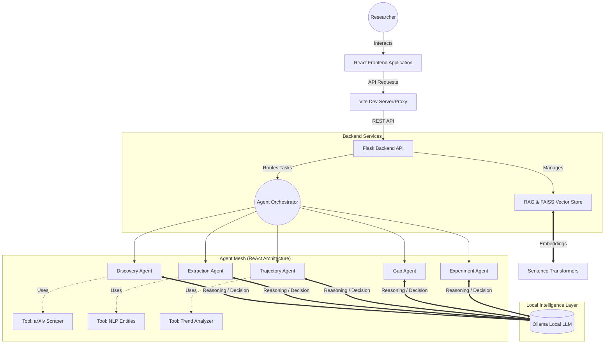

# Research Synthesis Suite


The **Research Synthesis Suite** is a cutting-edge, AI-powered platform designed to revolutionize literature review, research gap identification, and experimental design. Powered by **True Agentic AI**, it autonomously discovers, analyzes, and synthesizes academic papers to help researchers stay ahead of the curve.

---

## 🌟 Core Features & True Agentic AI

The suite implements **True Agentic AI** using the **ReAct (Reasoning + Acting)** pattern. Five specialized autonomous agents work together, equipped with tools and LLM-powered reasoning (via Ollama) to execute research tasks intelligently:

1. **DiscoveryAgent**: Autonomously optimizes search queries across arXiv, analyzes paper relevance, and refines searches to build high-quality literature corpora.
2. **ExtractionAgent**: Intelligently decides between keyword matching and LLM-based entity extraction. It reads papers, extracts techniques, metrics, and models with high accuracy.
3. **TrajectoryAgent**: Analyzes the historical evolution of research trends, robustly classifying the trajectory of topics based on temporal patterns.
4. **GapAgent**: Assesses research gaps and validates their temporal viability. It prevents recommending outdated gaps by labeling them as time-sensitive, future-viable, or likely-obsolete.
5. **ExperimentAgent**: Designs completely novel, future-aligned experiments precisely targeted at identified gaps, generating structured methodologies and selecting ideal datasets.

### ReAct Pattern Breakdown
Every agent executes a ReAct loop:
> **Thought**: The agent reasons about its goal and the current context. All thought processes are evaluated by local LLMs.<br/>
> **Action**: The agent selects a specific tool (e.g., `search_arxiv`, `extract_keywords`).<br/>
> **Action Input**: The agent determines the exact parameters for the tool.<br/>
> **Observation**: The tool executes locally, and the agent observes the result before deciding on the next step.

---

## 🏗️ Architecture & Flowchart

The application follows a decoupled client-server architecture:
- **Frontend Panel**: React-based UI guiding researchers through pipelines (Discovery → Synthesis → Gaps → Experiments).
- **Backend API**: Flask serving as the orchestration layer, managing the Vector Database (FAISS) and local NLP embeddings.
- **Agent Mesh**: Python-based autonomous agent system actively communicating with local open-source LLMs via Ollama.



---

## 🛠️ Tech Stack

### Frontend
- **Framework**: [React 18](https://react.dev/) + [Vite](https://vitejs.dev/) + [TypeScript](https://www.typescriptlang.org/)
- **Styling**: [Tailwind CSS](https://tailwindcss.com/)
- **UI Components**: [shadcn/ui](https://ui.shadcn.com/), Radix UI
- **Data Visualization**: [Recharts](https://recharts.org/)
- **State/Routing**: React Router, React Query

### Backend
- **Framework**: [Python 3.8+](https://www.python.org/) + [Flask](https://flask.palletsprojects.com/)
- **Vector Database**: [FAISS](https://github.com/facebookresearch/faiss) (CPU-optimized)
- **Embeddings**: [Sentence Transformers](https://sbert.net/), PyTorch
- **Data processing**: Scikit-Learn, NumPy, SciPy

### Artificial Intelligence & Local LLMs
- **LLM Engine**: [Ollama](https://ollama.com/) (Running locally)
- **Models Used**: Llama 3.2 (3B or 1B parameters recommended for smooth local execution)
- **Agent Framework**: Custom Python ReAct orchestration (eliminating heavy LangChain dependencies for speed and fine-grained control)

---

## 🚀 Setup & Installation

### Prerequisites
1. **Python 3.8+** installed
2. **Node.js 18+** and npm installed
3. **Ollama** installed and running on your local machine

---

### Step 1: LLM Engine (Ollama) Setup
1. Download and install [Ollama](https://ollama.ai/).
2. Open a terminal and pull the required model (smaller model recommended for machines with limited GPU VRAM):
```bash
ollama pull llama3.2:3b
# Or for even strictly constrained environments: ollama pull llama3.2:1b
```
3. Keep the Ollama server running:
```bash
ollama serve
```

---

### Step 2: Backend Setup
1. Navigate to the backend directory:
```bash
cd research-synthesis-suite/backend
```
2. Create and activate a Python virtual environment:
```bash
# Windows
python -m venv venv
venv\Scripts\activate

# macOS / Linux
python -m venv venv
source venv/bin/activate
```
3. Install Python dependencies:
```bash
pip install -r requirements.txt
```
4. Set up environment variables. Copy `.env.example` to `.env` (if exists), or export manually:
```bash
# Linux/macOS
export OLLAMA_BASE_URL="http://localhost:11434"
export OLLAMA_MODEL="llama3.2:3b"

# Windows PowerShell
$env:OLLAMA_BASE_URL="http://localhost:11434"
$env:OLLAMA_MODEL="llama3.2:3b"
```
5. Run the Flask Server:
```bash
python app.py
# Backend runs on http://localhost:5005
```

---

### Step 3: Frontend Setup
1. Open a new terminal and navigate to the project root:
```bash
cd research-synthesis-suite
```
2. Install Node.js dependencies:
```bash
npm install
```
3. Start the Vite development server:
```bash
npm run dev
# Frontend runs on http://localhost:8080
```

---

## 🔌 API Reference

The backend exposes several modular points (all automatically proxied from the React frontend in dev via `/api/*` to `http://localhost:5005/api/*`):

- `POST /api/discover/` - Agentic discovery of research papers via arXiv.
- `POST /api/clusters/` - Extraction and semantic FAISS clustering of techniques/topics.
- `POST /api/synthesis/` - Cross-paper comprehensive literature synthesis.
- `POST /api/gaps/` - Agentic temporal evaluation of research gaps.
- `POST /api/experiments/` - Agentic design of novel experiment proposals based on valid gaps.
